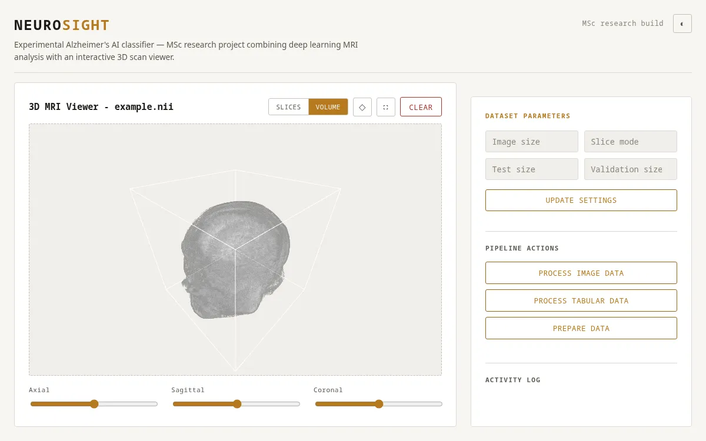

# scanview

Experimental Alzheimer's detection from MRI brain scans, built for an MSc dissertation — deep learning classification paired with an interactive 3D scan viewer.

**Live demo:** [scanview.cmclennan.dev](https://scanview.cmclennan.dev) — upload a `.nii` scan and classify it against the trained model.

<p align="center">
  <a href="https://www.python.org/"></a>
  <a href="https://www.tensorflow.org/"></a>
  <a href="https://flask.palletsprojects.com/"></a>
  <a href="https://threejs.org/"></a>
  <a href="LICENSE"></a>
</p>

<p align="center">
  
</p>

## Abstract

This project investigates whether deep learning models can detect Alzheimer's disease from structural MRI brain scans, and builds a web-based platform for exploring that data in 3D. The models perform reasonably on the training distribution, but the more useful finding is where they break down: MRI alone struggles to differentiate Alzheimer's from other neurological conditions with similar structural presentation, which points toward multi-modal diagnosis (imaging plus clinical/tabular data) as the more realistic direction, not a single-scan classifier.

## Key findings

- Deep learning models can pick up on Alzheimer's-associated structural patterns in MRI, but accuracy drops sharply when distinguishing it from other neurological conditions with overlapping presentation — a single MRI scan is not sufficient signal on its own.
- Clinicians already favour CT over MRI for most diagnostic imaging in this space; this project's results are consistent with why — MRI's added structural detail didn't translate into a meaningfully more reliable classifier.
- Emerging research suggests Alzheimer's may originate in the gut before affecting the brain, which reframes brain-MRI-only detection as inherently late-stage — a multi-modal, multi-region approach is likely the more promising research direction.
- The frame/slice selection step (choosing which of ~256 slices per scan actually carries diagnostic signal) turned out to matter more for downstream accuracy than model architecture choice.

## Methodology

1. **Data preprocessing** — skull stripping (isolating brain tissue from skull/background, since the skull carries no diagnostic signal and can only add noise), frame selection, and resizing/reshaping scans to a consistent resolution against the training set.
2. **Model development** — a custom CNN, a transfer-learning approach on a pretrained base, and an LSTM variant, compared against each other.
3. **Data augmentation** — used to compensate for a limited dataset size; traded off against a real risk of overfitting on augmented variants of the same underlying scans.
4. **Feature engineering** — PCA and pooling strategies explored for dimensionality reduction ahead of classification.
5. **Visualisation** — a Flask + Three.js platform for exploring scans in 3D, independent of the classification pipeline, built so results and raw data are inspectable rather than opaque.

### Frame selection

MRI scans are 3D volumes (~256 slices each in this dataset); only some slices carry diagnostically useful information. Rather than skull-strip every slice of every scan, a lighter frame-selection model was trained first (on a labelled subset from [Kaggle](https://www.kaggle.com/code/hachemsfar/alzheimer-mri-model-data-exploration/data)) to pick the useful slices per scan before the heavier skull-stripping/classification pipeline runs on those — cutting the volume of data that needs full processing.

## Results and limitations

- Model accuracy was inconsistent across disease subtypes: strong at distinguishing healthy vs. diseased, much weaker at distinguishing *which* neurological condition when several present similarly on MRI.
- Dataset size and diversity were the binding constraint, not model architecture — augmentation helped but couldn't fully substitute for more real, varied scans.
- Each patient has 2+ scan sessions under one Security ID (SID); collapsing multiple sessions into one row per patient (rather than treating sessions independently) was necessary to avoid leaking patient identity across train/test splits.

## Future work

- Multi-modal integration — combining imaging with clinical/tabular data (cognitive test scores, demographics) rather than imaging alone.
- Additional imaging modalities (PET, CT) alongside MRI.
- Longitudinal data to track progression rather than single-timepoint classification.
- Explainable AI techniques, so a clinician-facing tool could show *why* a scan was flagged, not just a label.

## Tech stack

| | |
|---|---|
| **ML / backend** | Python, TensorFlow/Keras, PyTorch (skull-stripping via [deepbet](https://github.com/wwu-mmll/deepbet)), Flask, Pandas, NumPy, SciPy, OpenCV, scikit-learn, scikit-image, Nibabel (NIfTI file I/O) |
| **Frontend** | Vanilla JS (ES modules), Three.js (3D volume/slice rendering), hand-written CSS |
| **Data** | MRI scans in NIfTI format, tabular clinical data, stored in AWS S3 |
| **Deployment** | Docker, GitHub Actions CI/CD |

## Running it

### Docker

```bash
docker compose up --build
```

Visit `http://localhost:5000`.

### Local (Python venv)

```bash
python -m venv .venv
source .venv/bin/activate  # Windows: .venv\Scripts\activate
pip install -r requirements.txt
flask run
```

Visit `http://localhost:5000`. Drop in your own `.nii` file, or click one of the bundled example scans to load it without needing the full dataset — click **Slices**/**Volume** in the toolbar to switch view modes.

> **Note:** `requirements.txt` pins `tensorflow-intel` for Windows only (`sys_platform == "win32"`) — it's a Windows-only package and breaks installs on Linux/Mac otherwise.

## Data

- **MRI scans** — 3D structural brain scans, NIfTI format, ~256 slices per scan, 2+ sessions per patient.
- **Clinical data** — demographics, cognitive test scores, and diagnosis labels, joined to imaging data by patient Security ID (SID).

The bundled example scans (`data/raw/example.nii` plus three from [OpenNeuro ds003592](https://openneuro.org/datasets/ds003592), CC0) are for demoing the viewer and classifier; none were in the training dataset.

## Acknowledgements

Completed as part of an MSc in Data Science and Advanced Computing at the University of Reading.

## License

MIT — see [LICENSE](LICENSE).
